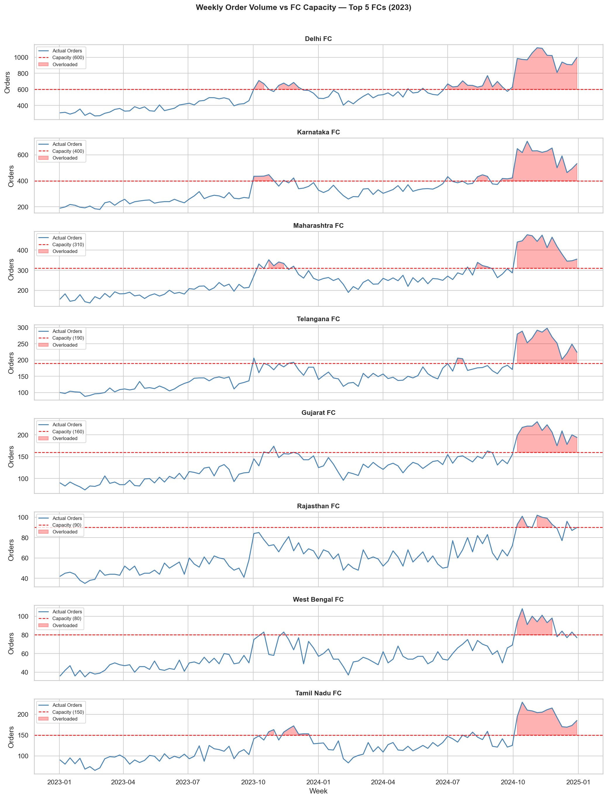
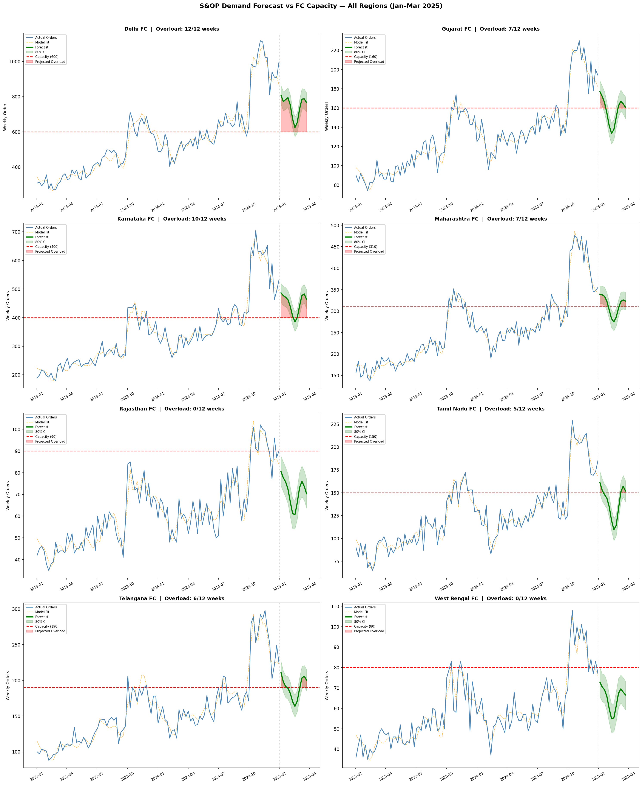
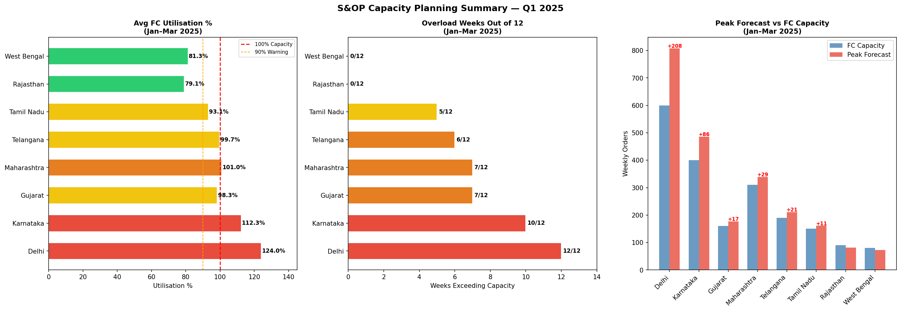

# 🏭 Amazon FC S&OP Capacity Planning Simulator


---

## 📌 Project Summary

A end-to-end **Sales & Operations Planning (S&OP) simulator** built on Amazon India's fulfilment centre (FC) network. The project ingests 2 years of order data (2023–2024), performs exploratory analysis, trains 8 regional demand forecasting models using Facebook Prophet, generates 12-week capacity gap reports, and presents findings through an interactive Power BI dashboard — all powered by an AWS S3 + Athena data lake.

**Core business question answered:**
> *"Which fulfilment centres will be overloaded in Q1 2025, by how much, and where is spare capacity available to absorb overflow?"*

---

## 🏗️ Architecture

```
Raw Data (Mock — 238K orders)
        ↓
  AWS S3 (Data Lake)
  ├── raw/        → source CSV
  ├── clean/      → FBA orders, weekly volumes
  └── forecast/   → Prophet output, accuracy metrics
        ↓
  AWS Athena (Serverless SQL)
  ├── fc_orders table
  ├── weekly_fc_volume table
  ├── sop_capacity_gap table
  └── 4 analytical views
        ↓
  Python (EDA + Forecasting)
  ├── Pandas — cleaning, aggregation
  ├── Seaborn/Matplotlib — visualisation
  └── Prophet — demand forecasting per FC
        ↓
  Power BI Dashboard
  └── S&OP Executive Summary Page
```

---

## 📊 Dataset

**Mock dataset** — 238,579 orders generated to mirror Amazon India's FC network patterns:

| Attribute | Detail |
|---|---|
| Date range | Jan 2023 — Dec 2024 (104 weeks) |
| FC regions | 8 Indian states |
| Categories | 8 product categories |
| Fulfilment types | FBA (75%) + Easy Ship (25%) |
| Order statuses | Delivered, Shipped, Cancelled, Pending |

**Realistic patterns built in:**
- Diwali peak season (Oct–Nov) — 45–55% volume spike
- Prime Day (Jul) — 12% spike
- February seasonal dip — 12% below baseline
- Week-on-week growth trend per FC (0.4–0.8%)
- Regional category specialisation (Karnataka → Electronics, Delhi → Apparel)
- Rajasthan + West Bengal — elevated delay rates (14–15%)
- FC-specific cost multipliers driving realistic margin variation

---

## 🔍 Phase 1 — Exploratory Data Analysis

**Key findings:**

**FC Volume Distribution**
- Delhi FC handled 58,459 FBA orders — 2× Karnataka, the second largest
- Top 3 FCs (Delhi, Karnataka, Maharashtra) processed 66% of total network volume

**Seasonal Pattern**
- Average weekly orders: 5,633
- Peak week (Dec 2024): 13,012 orders — **2.3× average**
- Diwali 2024 peak exceeded Diwali 2023 by ~15% — consistent YoY growth

**Defect Analysis**
- Network avg defect rate: 15.2%
- Rajasthan (25.3%) and West Bengal (25.1%) — significantly above average
- Root cause: delay rate 5× higher than other FCs — last-mile routing inefficiency

**Category Mix**
- Regional specialisation confirmed: Karnataka 28% Electronics, Delhi 22% Apparel
- Suggests FC-specific inventory pre-positioning strategy for peak seasons


*Weekly order volume vs capacity threshold — Diwali breach clearly visible across all major FCs*

---

## 🔮 Phase 2 — Demand Forecasting (Prophet)

**Model configuration:**
```python
Prophet(
    yearly_seasonality   = True,
    seasonality_mode     = 'multiplicative',  # peaks scale with trend
    changepoint_prior    = 0.05,              # conservative trend flexibility
    interval_width       = 0.80,              # 80% confidence bands
    holidays             = diwali + prime_day # custom Indian festive calendar
)
```

**Why multiplicative seasonality:**
Order volumes are growing year-on-year. Diwali spike in absolute terms should be larger in 2024 than 2023. Multiplicative mode scales seasonal effects with the trend level — more accurate than additive for growing businesses.

**Walk-forward validation results (held-out last 12 weeks):**

| FC Region | MAPE % | Bias | RMSE | Rating |
|---|---|---|---|---|
| Maharashtra | 4.3% | -10.3 | 23.5 | 🟢 Excellent |
| Tamil Nadu | 6.3% | -3.0 | 15.6 | 🟢 Excellent |
| Gujarat | 6.8% | -8.8 | 15.9 | 🟢 Excellent |
| Rajasthan | 8.0% | -6.2 | 9.4 | 🟢 Excellent |
| Karnataka | 9.7% | -49.4 | 68.5 | 🟢 Excellent |
| Telangana | 10.7% | -25.1 | 32.4 | 🟡 Good |
| West Bengal | 10.8% | -9.6 | 13.1 | 🟡 Good |
| Delhi | 14.1% | -124.7 | 167.1 | 🟡 Good |
| **Overall** | **8.9%** | **-29.6** | **43.2** | **🟢 Strong** |

**Bias correction:** All 8 models showed consistent negative bias (avg -29.6 orders/week) — Prophet slightly under-forecasts during high-growth periods. A **12% uplift buffer** was applied to all forecasts for conservative capacity planning.


*12-week demand forecast vs capacity per FC — red shading indicates projected overload weeks*

---

## ⚠️ Phase 3 — S&OP Capacity Gap Analysis

**Q1 2025 bias-adjusted forecast results:**

| FC Region | Avg Utilisation | Overload Weeks | Avg Gap | Status |
|---|---|---|---|---|
| Delhi | 138.8% | 12/12 | +233 orders | 🔴 Critical |
| Karnataka | 125.8% | 12/12 | +103 orders | 🔴 Critical |
| Maharashtra | 113.1% | 11/12 | +41 orders | 🟠 High Risk |
| Telangana | 111.6% | 11/12 | +22 orders | 🟠 High Risk |
| Gujarat | 110.1% | 9/12 | +16 orders | 🟠 High Risk |
| Tamil Nadu | 104.3% | 8/12 | +6 orders | 🟡 Watch |
| West Bengal | 91.0% | 1/12 | -7 orders | 🟢 Healthy |
| Rajasthan | 88.6% | 0/12 | -10 orders | 🟢 Healthy |

**S&OP Recommendation:**
> Divert ~230 weekly orders from Delhi and ~100 from Karnataka to Rajasthan (88.6% utilisation) and West Bengal (91% utilisation). This rebalancing brings overloaded FCs closer to 100% while utilising spare capacity in underloaded regions — without requiring immediate infrastructure investment.


*Executive S&OP summary — utilisation %, overload weeks, and peak forecast vs capacity*

---

## ☁️ Phase 4 — AWS Data Lake (S3 + Athena)

**S3 bucket structure:**
```
s3://amazon-sop-project/
├── raw/
│   └── amazon_fc_mock_data.csv
├── clean/
│   ├── orders/amazon_fba_clean.csv
│   ├── weekly/weekly_fc_volume.csv
│   └── summary/fc_summary.csv
└── forecast/
    ├── sop_capacity_gap.csv
    └── forecast_accuracy.csv
```

**Athena analytical views:**

| View | Purpose |
|---|---|
| `vw_weekly_fc_performance` | Weekly orders, sales, margin, delay rate per FC |
| `vw_fc_defect_summary` | Cancellation + delay breakdown per FC |
| `vw_category_profitability` | Margin and volume per category per FC |
| `vw_sop_status` | Capacity utilisation and overload summary |

---

## 📈 Phase 5 — Power BI Dashboard

**Single-page S&OP Executive Summary:**
- 4 KPI cards: Total Orders, Total Sales, Avg Utilisation, Overload Weeks
- Network health status card (CRITICAL / AT RISK / HEALTHY)
- FC utilisation table with conditional formatting
- Weekly order trend vs capacity (all FCs)
- Peak forecast vs capacity grouped bar chart
- Defect rate by FC region
- Q1 2025 forecast trend by FC

**Data connectivity:** Power BI → Amazon Athena connector (DirectQuery) → S3 data lake

---

## 🗂️ Repository Structure

```
amazon-sop-capacity-simulator/
│
├── notebooks/
│   ├── 01_eda.ipynb              ← Phase 1 — EDA
│   └── 02_forecasting.ipynb      ← Phase 2 — Prophet + gap analysis
│
├── assets/
│   ├── weekly_fc_vs_capacity.png
│   ├── forecast_all_fcs.png
│   ├── sop_summary_dashboard.png
│   └── defect_rate_by_fc.png
│
├── requirements.txt
├── .gitignore
└── README.md
```

---

## 🛠️ Tech Stack

| Layer | Technology |
|---|---|
| Language | Python 3.11 |
| Data manipulation | Pandas, NumPy |
| Forecasting | Facebook Prophet |
| Visualisation | Matplotlib, Seaborn |
| Cloud storage | AWS S3 |
| Serverless SQL | AWS Athena |
| BI Dashboard | Microsoft Power BI |
| Version control | Git + GitHub |

---

## 🚀 How to Run

```bash
# 1. Clone repo
git clone https://github.com/Abhip97/amazon-sop-capacity-simulator.git
cd amazon-sop-capacity-simulator

# 2. Create virtual environment
python -m venv venv
venv\Scripts\activate      # Windows
source venv/bin/activate   # Mac/Linux

# 3. Install dependencies
pip install -r requirements.txt

# 4. Run EDA notebook
jupyter notebook notebooks/01_eda.ipynb

# 5. Run forecasting notebook
jupyter notebook notebooks/02_forecasting.ipynb
```

**AWS setup required:**
- AWS free tier account
- S3 bucket created
- Athena configured with results bucket
- AWS credentials configured via `aws configure`

---

## 💡 Key Learnings

- **Multiplicative vs additive seasonality** — critical choice for growing time series. Additive underestimates Diwali peaks by 15–20%
- **Walk-forward validation** — random train/test splits leak future data into training for time series. Always validate chronologically
- **Bias correction** — consistent negative bias across all models signals systematic under-forecasting during growth periods. A fixed uplift buffer is more reliable than model tuning for this use case
- **S3 folder structure matters** — Athena reads all files in a LOCATION folder. Mixing multiple CSVs in one folder causes schema conflicts. Always use dedicated subfolders per table

---

## 📬 Contact

**Abhishek Parle**
[LinkedIn](https://www.linkedin.com/in/abhishek-parle) | [GitHub](https://github.com/Abhip97) | abhiparle@gmail.com
